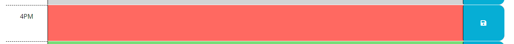
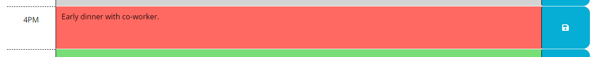

# workDayScheduler

## Description

A basic planner for your workday from 9am to 5pm. The current date will be shown at the top.

## Usage

Past hour will be displayed with a gray box.

Current hour will be red.

Future hours will be green.

Enter text, then click the blue save icon on the right of the text box. That will save the information you entered there in your schedule!

When you refresh, your saved information will be waiting for you!